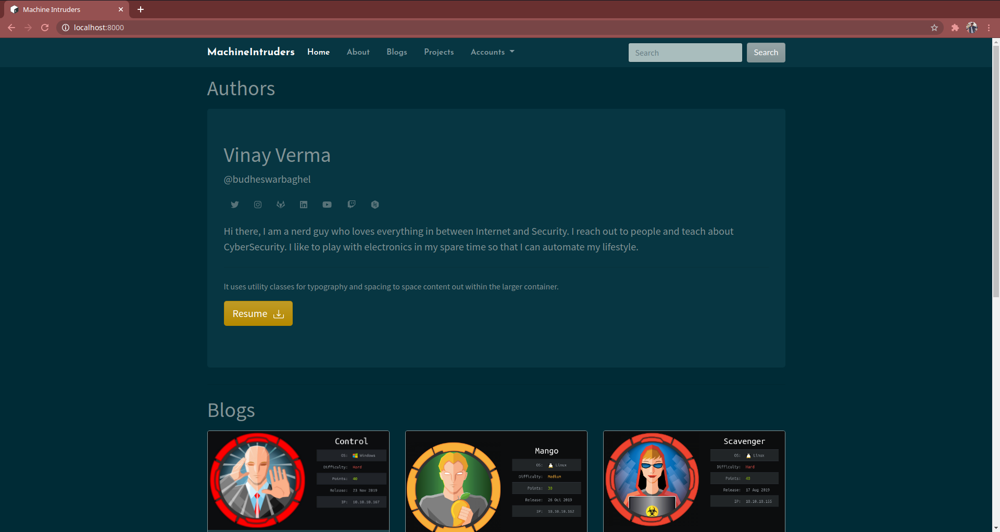
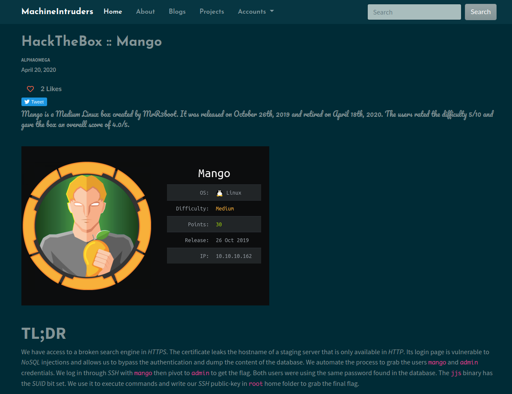
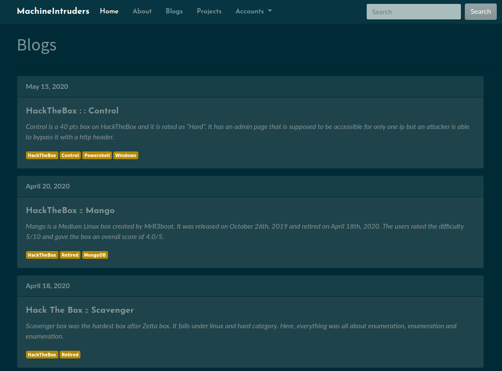
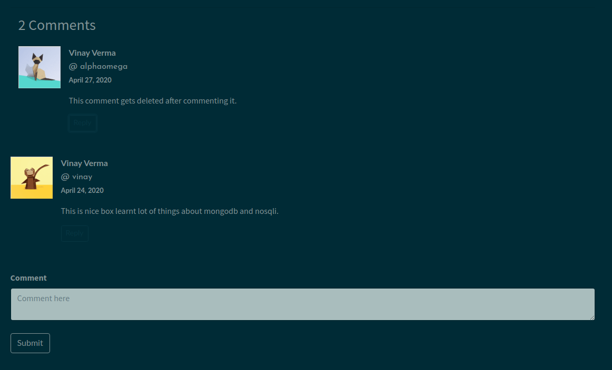
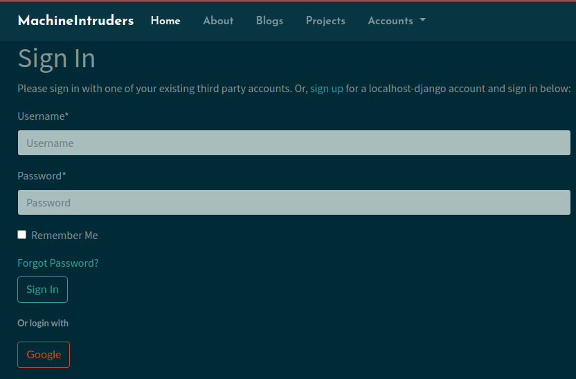
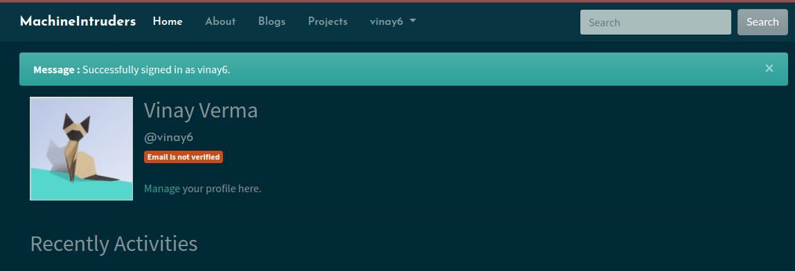

Blogging website built with django



### Installation:

Setup python virtual environment

```bash
pip3 install virtualenv
cd ~/.virtualenv
virtualenv django
```

Activate the environment

```bash
source ~/.virtualenv/django/bin/activate
```

Clone the repo and install the requirements

```bash
git clone https://github.com/devshmsec/machineintruders-blog.git
cd machineintruders-blog
pip install -r requirements.txt
```

Then run the server

```bash
./manage.py runserver
```

### Features:

- Views
    - Home view
    - Detail view

    

    - About view
    - Blogs view

    

    - Accounts view

- Detail view for the blog page
    - Comments Section
    - Like option



- Account Section
    - Register/Login with email
    - Login with google



- Profile Section
    - List of liked Articles
    - Profile Picture




### License

Licensed under the [MIT](LICENSE) license.